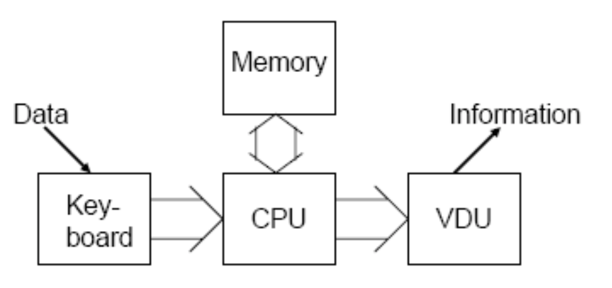
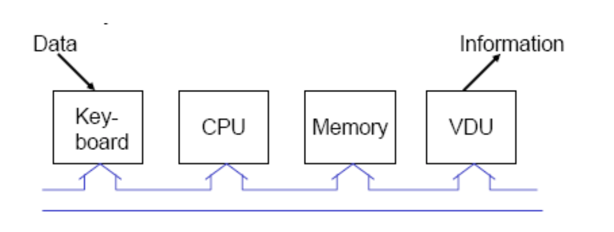
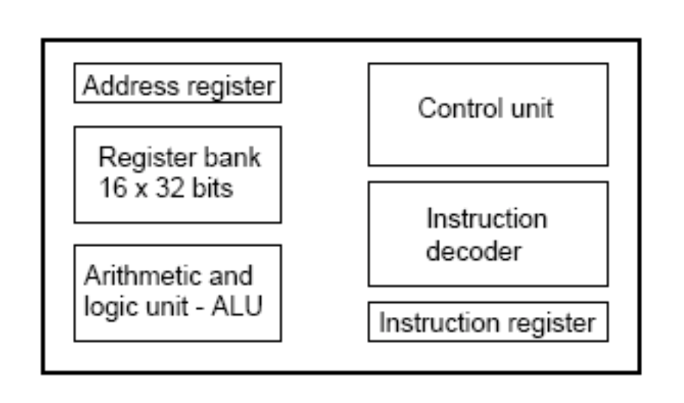
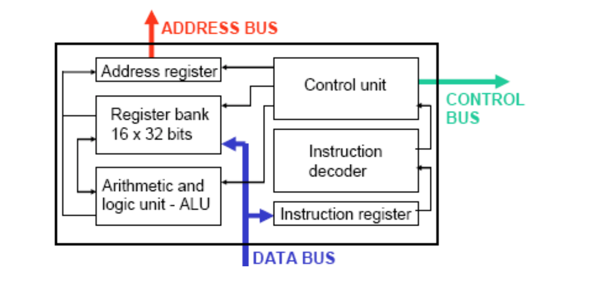

# Lecture 1

CPU

Microprocessor

## ARM7TDMI microprocessor

- T: 16-bit **T**humb code
- D: on-chip **D**ebug support
- M: an enhanced **M**ultiplier
- I: Embedded**I**CE hardward to give on-chip breakpoint and watchpoint support

## Revision - binary, hexadecimal,

`0x` denotes a hexadecimal number

## Representing characters

### ASCII

American Standard Code for Information Interchange

7 bit code

- the standard 26 characters of English in both upper and lower case
- characters such as `!#$%&()*+,- ./:;<=>?@[\]^_`
- the characters for numbers 0 to 9
- control ‘characters’ such as line feed, carriage return, delete, escape, backspace.
- It does not code for é or α or thousands of other non-English characters.

## A simple computer architecture

Data and information pass between the blocks as electrical signals.

However this architecture can become very complicated if
- more than one input device or
- more than one output device needs to be connected

## The Bus Architecture

The bus architecture can be extended over any number of devices. All devices have only one connection onto the ‘bus’.

A bus is a collection of electrical connections, normally 8, 16, 32 or 64 individual wires.

### Controlling the Bus

It is important that signals do not collide on the bus - only one device at a time can send data.

The **CPU controls** all movements on the bus using special wires to activate devices and to synchronize the sending and receiving devices.

These special connections are known as the **control bus** and they are completely **independent** of the bus along which data (called **data bus**) is passed.

### A Third Bus: Address Bus

The address bus is used by the CPU to determine which location in memory is sending or receiving data.

## What is in memory?

Memory is used to
- store the instructions which the CPU uses to process the data.
- store data in the form of numbers or characters.

Computer memory is **a very big sequential logic circuit made up of thousands or millions of simple logic gates**, such as a D type latch, which can remember a 0 or a 1, that is one bit of data.

Groups of these gates are collected together in a **memory ‘location’**. There are typically 8 bits of data (aka, **byte**) in one location.

**Each memory location has a unique memory address.**

### Memory organization

Example: ARM7TDMI microprocessor

- At each location, it has 8 bits (1 byte) of data.
- The ARM is a 32 bit processor and addresses are 32 bits long from `0x00000000` to `0xFFFFFFFF`.
- In theory, up to 4,294,967,296 (or $2^{32}$) different memory locations.
- In practice not all addresses are used for memory.

### Some definitions

- 1 byte = 8 bits
- 1 kilobyte = 1024 bytes
- 1 megabyte = 1024 kilobytes
- 1 gigabyte = 1024 megabytes
- A 32 bit processor could be directly connected to 4GB of memory using a 32 bit address bus if every memory address had memory connected.
- `word` depends upon the processor used.
  - for a 32 bit processor like the ARM
  - 1 word = 32 bits = 4 bytes
  - word length = 32

## CPU

- interprets the instructions stored in memory.
- performs the calculations.
- controls the flow of data along the data bus.
- determines which memory address to use.

### The ARM7 core

#### Instruction register

- The instructions stored in memory travel along the data bus to the CPU where they are loaded into the instruction register.
- ARM7 instructions are 32 bits long so the instruction register is a **32 bit memory device** - not part of the main memory.
- **`fetch`**: the process of loading the instruction register from memory.

#### Instruction decoder, Control unit

The instructions are in ‘machine code’ and the instruction decoder **determines the function of each instruction**.

The instruction decoder and control unit **determine what the other parts of the CPU do**.

The control unit is also **in charge of the control bus**.

**`decode` cycle**: the process of interpreting each instruction.

#### Arithmetic and Logic unit

The arithmetic and logic unit or ALU performs the mathematical functions as required.

**`execute` cycle**: the process of performing each instruction

#### Register bank

A local memory for the CPU.

It has **16** locations - each location can hold 32 bits of data.

The registers are named `r0`, `r1`, `r2`, `r3`, ... etc. up to `r15`.

#### Address register

A 32 bit memory device which holds a memory address value.

- Either this address may be for the memory location of the next instruction during the `fetch` cycle.
- Or during the `execute` cycle the address is for a memory location either containing data to be loaded into a register or where data from a register is to be stored.

### Fetch, decode, execute.

- During the fetch cycle an instruction in memory is loaded into the instruction register.
- During the decode cycle the instruction is interpreted by the instruction decoder.
- During the execute cycle
  - either the ALU performs a calculation on values held in registers or
  - a value in a register is stored into memory or • a value in memory is loaded into a register.

### Internal & External connections

### Program counter

Register `r15` always holds the memory address of the next instruction to be executed.

#### Instructions stored in memory

One instruction (32 bits long) would be stored in 4 memory locations

> When an instruction is executing, the program counter, r15, increments by 4 so that it holds the memory address of the next instruction.

> EXCEPT when a ‘branch’ instruction is executed when the computer program ‘branches’ to another part of memory and the program counter holds a completely new memory address.

## Machine code

`0xE3A0C072`

- `E3A0`
- `C`
- `72`

Move 114 into register `r12`

`0xE1A0600E`

- `E1A0`
- `6`
- `E`

Move into `r6` the value held in `r14`

...
