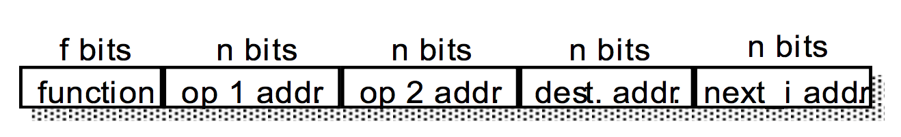
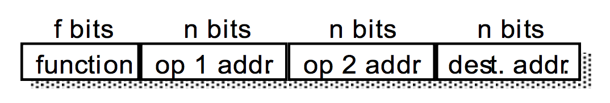
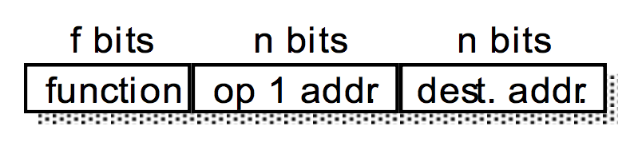

# Lecture 2

## Mnemonics

words or phrases which are easy to remember.

`MOV r12, #114` instead of `0xE3A0C072`

## Assembly Language

### Assembler

converts an assembly language program into a machine code program.

### Compiler

A high level language (such as Java, C++, Fortran, Pascal, etc.) is converted into either machine code or mnemonics using a computer package called a compiler.

Nobody writes computer programs using machine code.

## Instructions for Arithmetic

The ARM7 can add, subtract and multiply numbers (but not divide).

### Addition

`ADD rz, ry, rx`

add the value in `register x` to the value in `register y` and place the sum in `register z`.

### Subtraction

`SUB rz, ry, rx`

subtract the value in `rx` from the value in `ry` and place the difference in `rz`

Note that the order is important.

### Reverse Subtraction

`RSB rz, ry, rx`

subtract the value in `ry` from the value in `rx` and place the difference in `rz`

### Multiplication

`MUL rz, ry, rx`

multiply the value in `rx` to the value in `ry` and place the product in `rz`

If the result is more than 32 bits long the destination register, `rz`, only holds the bottom 32 bits of the result and the rest is lost. The same can happen with addition.

### Multiply and accumulate

`MLA rz, ry, rx, rw`

add the value in `rw` to the product of the value in `rx` and the value in `ry` and place the result in `rz`

This instruction is extensively used by digital filters for signal processing; e.g. mobile phones.

### Instructions using logic

`AND rz, ry, rx`

AND value in `rx` with value in `ry` and leave the result in `rz`

`ORR rz, ry, rx`

OR value in `rx` with value in `ry` and leave the result in `rz`

#### Exclusive OR

`EOR rz, ry, rx`

#### Bit clear

`BIC rz, ry, rx`

performs the function `ry AND NOT(rx)`

## Addressing modes

### Register Addressing

the instruction code includes a number (or numbers) that identifies a register (or registers).

### Immediate Addressing

the instruction code contains a value to be used.

`0xE3A0C0A0` `MOVr12,#0xA0`

move into r12 the value 0x000000A0

`#` means ‘immediate’.

#### More Immediate Addressing

- `ADD`, `SUB`, `RSB`, `AND`

#### Problem

a 32 bit value can not be put into a 32 bit register

#### Restrictions

The immediate value can only be one byte (8 bits) but it does not have to be the least significant byte.

The immediate value can be any value given by $N×2^{2M}$ where N is in the range 0 to 255 and M is in the range 0 to 15.

`MOV rZ, #`$N×2^{2(16-M)}$

`0xE3A0ZMNN`

### Indirect Addressing

uses a value in a register to identify a memory address

#### LOAD

`LDR r6, [r11]`

put (or ‘load’) into register `r6` the data held in the memory location that has the address given by the value in register `r11`.

square brackets `[ ]` denote indirect addressing.

The load instruction, unlike `MOV`, can be used to put a true 32 bit value into a register.

#### STORE

`STR r6, [r11]`

put (or ‘store’) the data from register `r6` into the memory location that has the address given by the value in `r11`.

### Endian

Each memory location holds 1 byte of data whereas each register holds 4 bytes of data.

#### Little endian

the least significant byte (‘the little end’) is stored at the lowest memory address

- `STR r6, [r11]`
- with `0xFFAABB11` in `r6` and `0x00008000` in `r11`
- would store byte
  - `0x11` at `0x00008000`
  - `0xBB` at `0x00008001`
  - `0xAA` at `0x00008002`
  - `0xFF` at `0x00008003`

#### Big endian

the most significant byte (‘the big end’) is stored at the lowest address.

- `STR r6, [r11]`
- with `0xFFAABB11` in `r6` and `0x00008000` in `r11`
- would store byte
  - `0xFF` at `0x00008000`
  - `0xAA` at `0x00008001`
  - `0xBB` at `0x00008002`
  - `0x11` at `0x00008003`

**The ARM processor can be configured as either little endian or big endian.**

Intel (e.g. the Pentium) uses little endian whereas Motorola uses big endian.

Load and store can also use half words and bytes.

### Half words and bytes

Load and store can also use half words and bytes.

The instructions `LDRH` and `LDRB` load the lowest 16 or 8 bits respectively of a register from a memory location given by indirect addressing.

The remaining 16 (for `LDRH`) or 24 bits (for `LDRB`) of the register are set to zero.

Similarly `STRH` and `STRB` store either the lowest 16 or 8 bits of a register at a memory location given by indirect addressing.

### Base plus offset addressing

uses a value in a register (the ‘base’) plus a binary number (the ‘offset’) to identify a memory address.

`LDR r6, [r11, #12]`

 load into `r6` the data held in the memory location that has the address given by the value in register `r11` added to `12`.

#### Automatic updating

`LDR r6, [r11, #12]!`

does the same as `LDR r6, [r11, #12]`, **but `12` is added to the value in `r11`**.

#### `!` 'pling'

# !!! Important

#### Pre-indexed and post-indexed

`LDR r6, [r11, #12]!`

is an example of **pre-indexing**, meaning that `12` to added to the base register, `r11`, before it is used as a memory address.

`LDR r6, [r11], #12`

is an example of **post-indexing**, meaning that `12` is added to the base register, `r11`, after it is used for the memory address.

??? There is no pling, `!`, for post-indexing because the base register is always updated.

## Instruction set design

### Complexity

#### Semantic gap

The difference between machine code and high level languages.

#### CISC = Complex Instruction Set Computer

1. Complicated CPU
2. Each instruction takes longer to execute
3. Fewer machine code instructions for each high level instruction
4. Good code density
5. Smaller semantic gap
6. Simple compiler

#### RISC = Reduced Instruction Set Computer

1. Simple CPU
2. Machine code instructions execute quickly
3. More machine code instructions for each high level instruction
4. Poor code density
5. Larger semantic gap
6. Complicated compiler

## Code density

a measure of the size of a computer program in memory for a given function.

Good code density produces smaller programs leading to **lower memory cost and less power dissipation in memory**.

There are a number of factors effecting code density.
1) How many bits in each machine code instruction.
2) The functionality of individual machine code instruction.
3) How good the compiler is.

### 4-operand (address) instruction format

The most general form of a machine code instruction

The first two operands and the destination could be given by either memory addresses and a number identifying an internal CPU register.

The last operand would identify the memory address of the next instruction to be performed.

### 3-operand instruction format

The first way to reduce the size of the instruction from (f+4n) bits to (f+3n) bits is to make the address of the next instruction implicit.

> ADD in the ARM instruction set

### 2-operand instruction format

The size of the instruction can be reduced to (f + 2n) bits by using the destination operand as one of the source operands.

Two operand instructions are implemented by the **Thumb instruction set** (with operands held in internal CPU registers, not memory).

### 1-operand (accumulator) instruction

A further reduction to (f + n) bits can be achieved by using an implicit destination register, often called the ‘accumulator’.

> The MU0 processor described in Furber, section 1.3, is an example of a one operand instruction architecture.

### 0-operand instruction format

The simplest form of instruction architecture is achieved by making all operand references implicit; often using the stack.

For an ADD instruction, the function would be

`top_of_stack := top_of_stack + next_on_stack;`

> The transputer designed by Inmos in the 1980’s uses this architecture.

...
