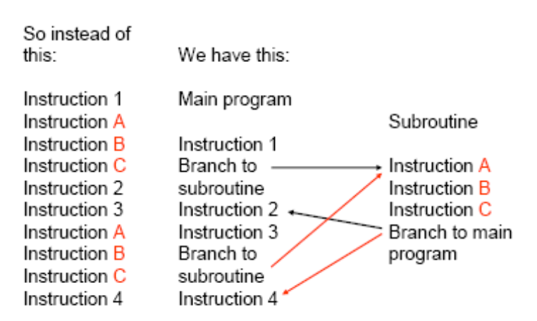
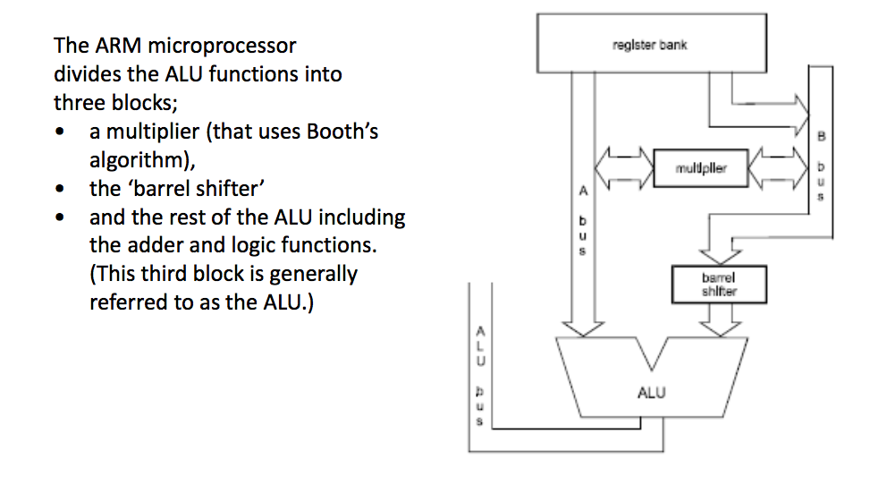

# Lecture 4

## Subroutines

Many microprocessor programs include groups of instructions which are repeated many times. They can be included once in a special structure known as a subroutine.

The main program branches to the start of the subroutine when it requires those particular instructions.

At the end of the subroutine there is another branch back to the main program.

### Link Register

holds **the memory address** of the instruction in the main program **to which the subroutine returns to**.

Register `r14` in the ARM microprocessor is designated as the link register and `r14` can be replaced by `lr` in mnemonics.

### Brach and Link `BL`

To return from the subroutine the value in the link register is moved into the program counter

- `MOV pc, lr.`

What happens if a branch and link occurs in a subroutine?

- The value held in the link register will be overwritten by a new return address so before one subroutine calls another the link register value must be stored elsewhere.

### Nested subroutines

In order to preserve the return address of all subroutines an area of computer memory called the **stack** is used.

### Stack

**last in first out** queue.

#### Stack Pointer

holds an address in memory that identifies the top of the stack.

The address is
- **full stack**: either the location of the last data to be pushed onto the
stack
- **empty stack**: or alternatively the location of the next empty slot where the next data can be placed.

ARM microprocessor allows both kinds.

#### Ascending and descending stacks

For an ascending stack, the memory address of the top of the stack is **greater** than the memory address for the bottom of the stack.

Register `r13` is used as the stack pointer and it can be replaced in mnemonics with `sp`.

`STMFD sp!, {lr}`

To push the link register value onto a full descending stack

`LDMFD sp!, {lr}`

To pop a value from a full descending stack back into
the link register

### Stacks and Subroutines

1. The first instruction in a subroutine is

`STMFD sp!, {lr}`

2. Then any branch and link in that subroutine can overwrite the link register.

3. The subroutine would end by popping the return address from the stack into the link register.

`LDMFD sp!, {lr}`

4. followed by moving value in the link register into the program counter

`MOV pc, lr`

- replace these two instruction with one

`LDMFD sp!, {pc}`

### Stacking other registers

Pushing and popping the stack can be achieved with several register at the same time

- the mnemonics `LDM` and `STM` stand for load multiple and store multiple.

`STMFD sp!, {r6-r9, lr}`

push registers r6, r7, r8 and r9 with the link register

`LDMFD sp!, {r6-r9, pc}`

pop the same registers

! Great care must be taken when using push and pop to **ensure that the number of pops is the same as the number of pushes**.

Order for Store: `r15`, `r14`, ..., `r0`

Order for Load: `r0`, `r1`, ..., `r15`

## Barrel shifter

a very useful feature of the ARM7 microprocessor which allows bit patterns to be rotated.

`MOV r1, r2, LSL #5`

take the bit pattern in register `r2` and shift it 5 places to the left before placing it in register `r1`.

Arithmetic Logic Unit: ALU

Different Shifts

- Logical shift left (`LSL`)
- Logical shift right (`LSR`)
- Arithmetic shift right (`ASR`).
  - bits are shifted rightwards and the new bits added in are the same as the ‘old’ sign bit; that is the msb of the input.
- Rotate right (`ROR`)
- Rotate extended (`RRX`)
  - bits are shifted right one place only and the carry flag is shifted into the new most significant bit. The least significant bit is shifted into the carry flag only if the mnemonic specifies an S.

### Using shift and add to multiply

`MOV rx, ry, LSL #n ;`  multiplies value in `ry` by $2^n$

`ADD rx, ry, ry, LSL #n ;` multiplies value in `ry` by $2^n+1$

### Using shift to do integer division

`MOV rx, ry, ASR #n ;` divides value in `ry` by $2^n$

...
