# Lecture 5

## Interrupts

provide a very convenient method for dealing with events and this method is often used for events that are not unexpected

An interrupt is triggered when the microprocessor receives a (voltage) signal on a special connection within the control bus.

Two types of interrupts

- a normal interrupt (IRQ)
- a fast interrupt (FIQ)

### Interrupt Handling

On receiving an interrupt signal, the microprocessor switches **mode**.

user mode, IRQ mode, FIQ mode

Each mode has it’s own link register and stack pointer.

In addition, FIQ mode has its own registers `r8` to `r12`.

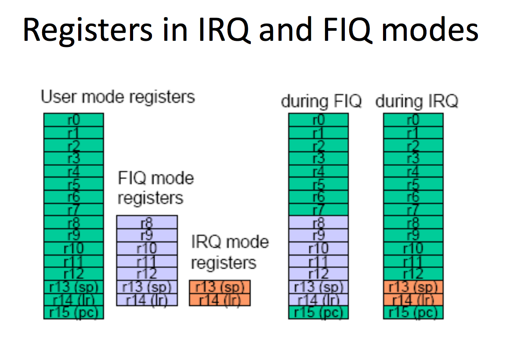

### Current Program Status Register

used in user-level programs to store the condition code bits

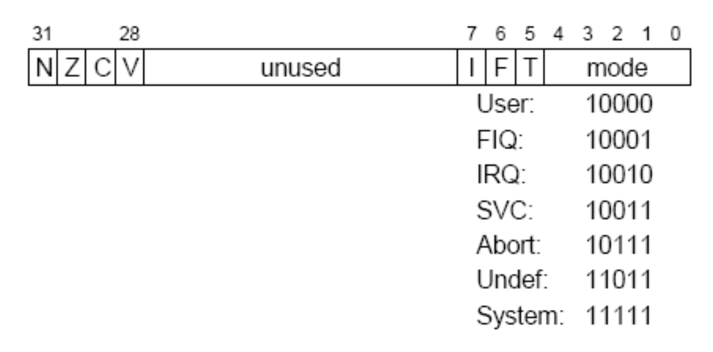

#### When an interrupt occurs the following happens:

1. The registers for IRQ mode or FIQ mode are activated.
2. The current program status register, `CPSR`, (this contains the flags and other information) is saved into a saved program status register, `SPSR`.
> (There are two SPSR registers, one for each mode.)
3. The return address of the next instruction to be executed in the main program is stored in the link register for the appropriate mode.
4. The program counter is set to either `0x00000018` for an IRQ or `0x0000001C` for a FIQ. (these addresses are known as **vectors**)

> For an IRQ the instruction at address `0x00000018` must be a branch to another part of memory because the following memory location, `0x0000001C` contains the first instruction of the FIQ handler.

### Returning from Interrupts

- The saved program status register is copied back into the current program status register.
- The link register in the IRQ mode or FIQ mode is copied into program counter.
- The microprocessor returns to the mode it was in before the interrupt occurred - normally user mode.

### FIQ or IRQ ?

Generally the most important interrupt is assigned to the FIQ and all other interrupts are assigned to IRQ.

Reasons:

1. IRQ is disabled by an FIQ and if a FIQ and an IRQ occur simultaneously the FIQ is serviced first.
2. FIQ can be serviced as quickly as possible because
    1. there is no need to branch as for an FIQ and
    2. normally user mode registers are pushed onto the stack when an interrupt occurs so that they are not corrupted but for an FIQ there is no need to stack registers r8 to r12.

## Instruction Pipelines

an important feature of all modern microprocessors.

an n stage instruction pipeline allows the microprocessor to execute up to n times as many instructions in a given time.

The ARM7 microprocessor has a 3 stage pipeline, one stage for each of the CPU cycles.

##### `fetch`, `decode` and `execute`.

In a three stage pipeline, the CPU can simultaneously execute an instruction, decode the next instruction and fetch the next instruction.

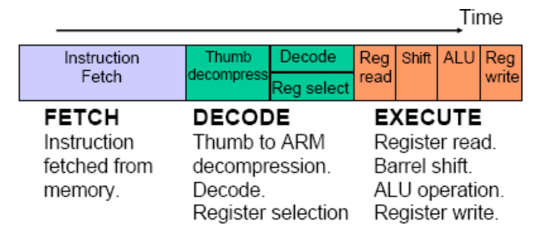

### Optimum Operation

A pipeline operates optimally if the instructions to be executed are in consecutive memory locations and no conflict occurs on the data bus.

When this is the case, the microprocessors operates at one clock cycle per instruction (1 CPI).

The best performance cannot be achieved if a branch or load instruction is executed or if an interrupt is serviced.

#### Branch Instruction

A branch instruction will reload the program counter so that two cycles are lost.

If not executed then no clock cycles are lost.

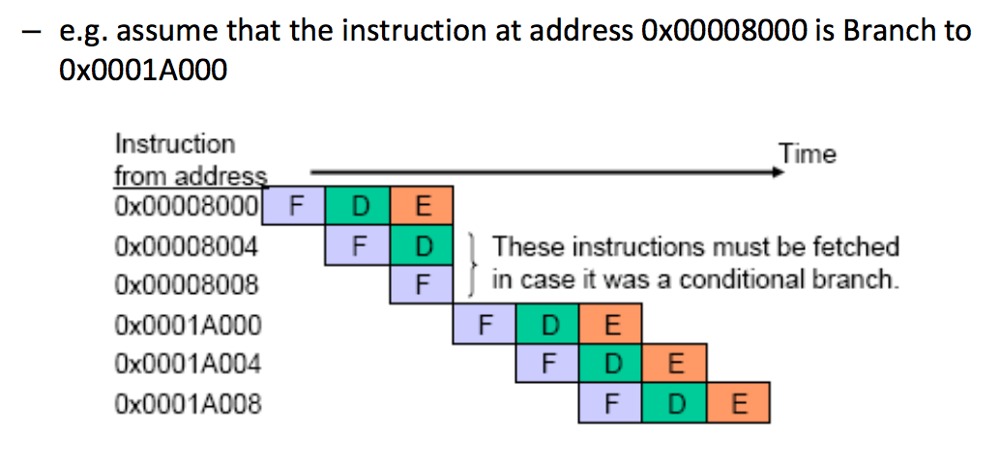

#### Interrupts

An IRQ reloads the program counter with `0x00000018` and then branches so that the pipeline is broken twice.


#### Interrupt latency

the time between the microprocessor receiving an interrupt signal and the first instruction being executed.

The minimum latency for an IRQ is 7 clock cycles.

> minimum because an IRQ could be interrupted by an FIQ.

The minimum latency for an FIQ is 4 clock cycles.

> no need to branch

> FIQ can be interrupted by a system reset.

#### Load and store instructions

use the data bus to pass data to or from memory so that the data bus cannot be used to fetch an instruction at the same time.


#### Eliminating bus conflicts

- Harvard architecture

uses two separate data buses; one for instructions and one for load and store data.

- von Neumann architecture

(for a microprocessor, such as the ARM7)

uses one data bus for both instructions and data.

#### Von Neumann or Harvard?

- advantage: fewer lost clock cycles due to bus conflicts
- drawback: greater complexity

> The ARM9 (next generation after ARM7) has a Harvard architecture and a five stage instruction pipeline.

#### 3 stage or 5 stage pipeline?

> The maximum clock frequency of the ARM7 is limited by a bottleneck during the execute stage of the 3 stage pipeline.

> The ARM9 has a 5 stage pipeline so that there is less work in each stage of the pipeline and therefore a higher maximum clock frequency can be achieved for the same technology.

> However more stages require more power because more circuits are functioning simultaneously.

### ARM organization

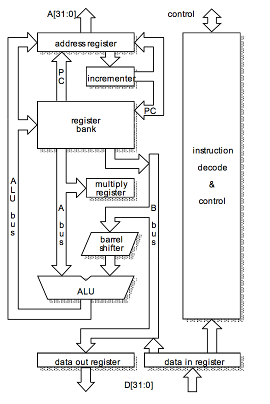

### ARM7 pipeline example

`ADDNE r11, r3, r7 LSR #8`

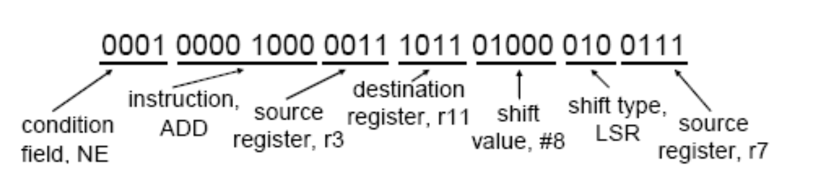

#### `FETCH`

The instruction is fetched from a memory location with address given by the value in the address register.

#### `DECODE`

The first action of the decode cycle only applies to 16 bit Thumb instructions. Thumb code is converted (decompressed) into 32 bit ARM code if the processor is in ‘Thumb mode’.

In 2nd part of the decode cycle, the instruction, is decoded.

The condition field is compared with flags to see if
the instruction is to be executed.

#### `EXECUTE`

- Register read.

The values held in the two source registers are read onto the internal buses

- Barrel shift.

Output of the barrel shifter is connected to the second input of the ALU.

- ALU

The output of the ALU is connected to the ALU bus.

- Register write.

The value on the ALU bus is written into the destination register.

> ALU is not used to increment the program counter and address register so that it is free to execute instructions.

### Another example: immediate

`SUBS r8, r13, #57600`

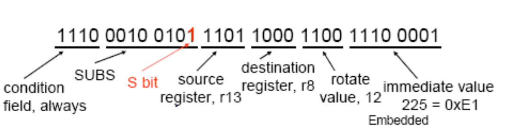

> The ARM7 barrel shifter only supports ‘rotate right’, not ‘rotate left’. This is not a problem because a rotate left by x bits is equivalent to a rotate right by (32 – x) bits.

### ARM core: not pure RISC

```
ARM cores do not implement all of the features proposed by Patterson and Ditzel. The features included are:
1. Load-store architecture;
2. Fixed length 32-bit instructions with few formats;
3. Hardwired combinational decode logic;
4. Pipelined execution.

The rejected features are:
1. The large register bank, the ARM only has 16 registers;
2. Delayed branches;
3. Single-cycle execution of all instructions.
```

### ARM: multiple cycle instructions

1. Multiplication – could be executed in a single cycle but would need a disproportionately large no. of gates;
2. Memory data access – there needs to be two memory accesses, one for the instruction & one for the data, so the ARM7 uses 2 cycles. Other processors use 2 buses, 2 caches or 2 memories i.e. Harvard architecture. ARM uses extra cycle for features e.g. auto-indexing.
3. Branches – result in pipeline flush. Wasted cycles used to update ‘link register’.

### ARM7 branch example

`BLCS label`

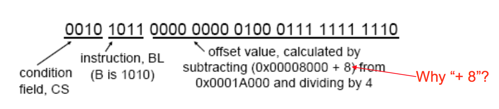

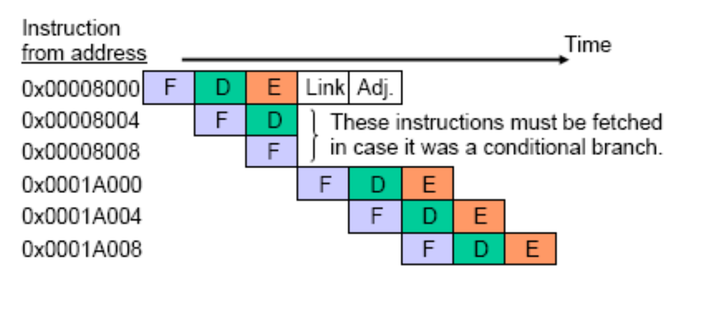

3 cycles of `EXECUTE`

1. ALU adds two values, (`0x00008008` & `0x00011FF8`) to find a new memory address (`0x0001A000`) to be loaded into the address register.
2. Value (`0x00008008`) in `r15` (PC) is loaded onto the A bus and passed through the ALU (no action) to `r14`
3. Value in `r14` (`LR`) is adjusted by subtracting 4 in the ALU & the new value `0x0008004` is stored back in `r14`. `r15`, the PC, is brought up-to-date.

???
> The link register must be adjusted because the program counter is 8 ahead of the instruction being executed, whereas the return address is only 4 ahead.

### ARM7 pipeline and Store

`STR r5, [r7], #20`

post-indexing

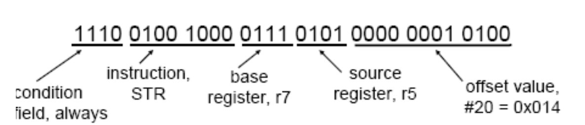

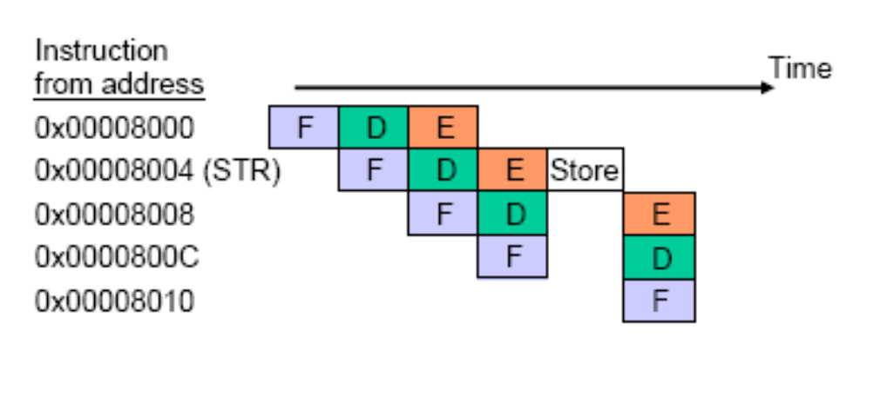

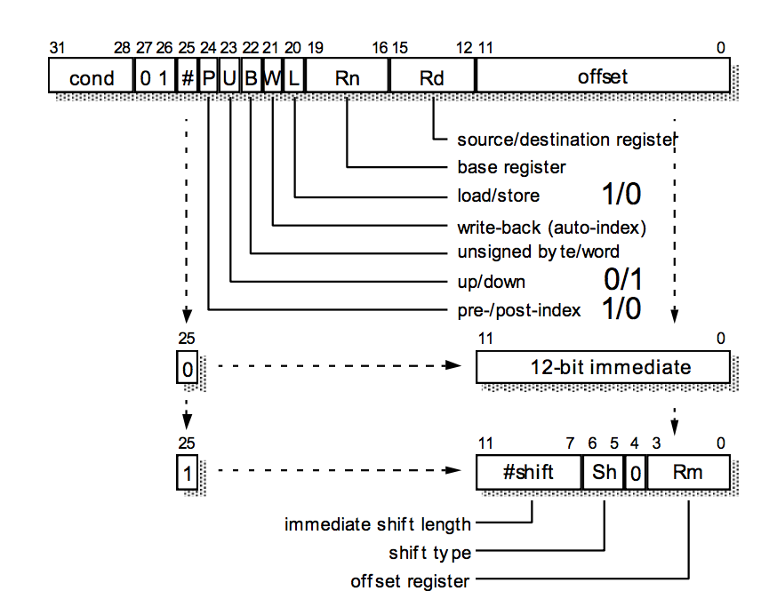


### ARM7 pipeline and Load

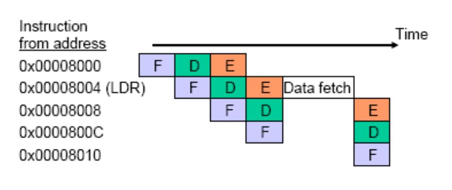

`LDR r9, [r7, #-20]!`

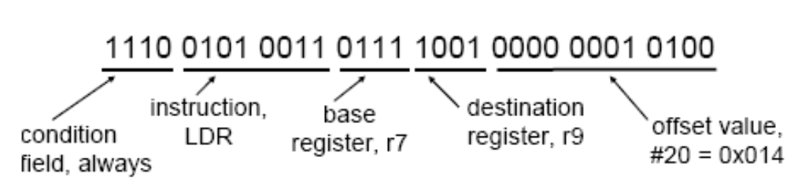

Load and store have many options e.g.
1. offset by either immediate or register,
2. positive or negative offset (or zero),
3. pre-indexing or post-indexing of base register,
4. automatic updating, ‘pling’, of base register (pre-indexing only),
5. byte or word.

### Why provide auto indexing?

Auto-indexing saves one clock cycle (and power dissipated in memory) by using spare resource during the load/store.

### Further cycle saving

More clock cycles can be saved if more than one register is loaded or stored by a single instruction.

LDM takes (2 + n) clock cycles to execute where n is the number of registers loaded.

Likewise STM takes (1 + n) clock cycles.

### ARM7 Store Multiple example

`STMFA r13!, {r0-r2, r14}`

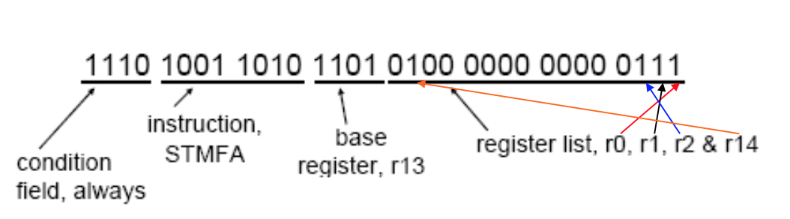

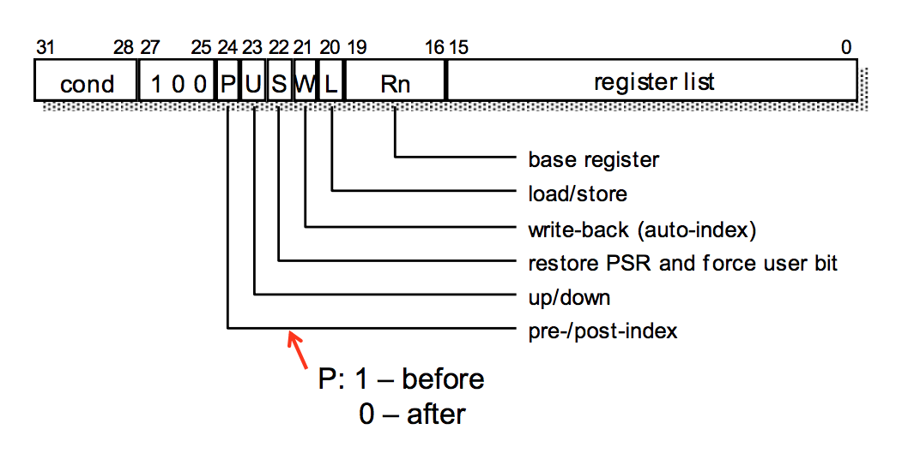

### ARM7 performance

ARM7 does make efficient use of the data bus with nearly every clock cycle used for either an instruction pre-fetch or a data load/store.

The data bus is only idle during
- the last cycle of load (LDR/LDM)
- all but the first cycle of a multiply (MUL/MLA) instruction.

### Performance improvements

Performance improvements can be gained by including:

- More pipelining i.e. longer pipeline
- Harvard architecture
- Delayed branches
- Additional specialized instructions

#### Longer pipelines

The ARM9 5 stage pipeline is more balanced because the ‘execute’ functions are spread over two and a half pipeline stages called `execute`, `memory` and `write`.


Register read is moved into the decode stage and register write is delayed until after a separate stage for any memory data access (load/store).

More stages = less activity
= higher clock frequency
= higher performance

### ARM9 optimal pipelining

(See slides)

### ARM10: 6 stage pipeline

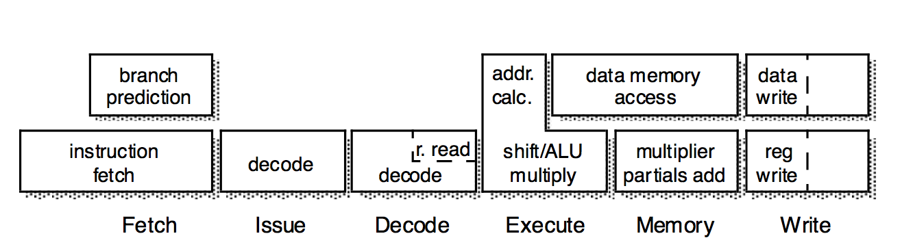


...
