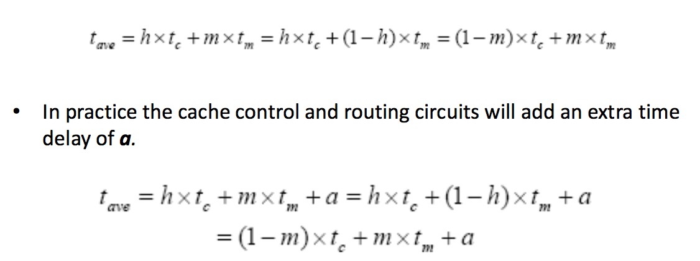
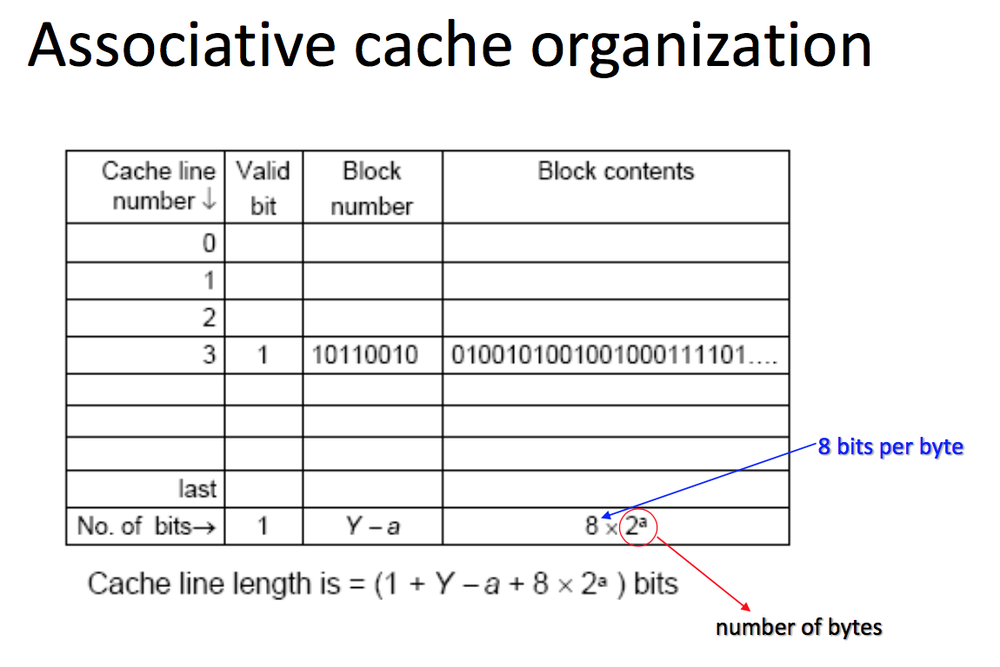
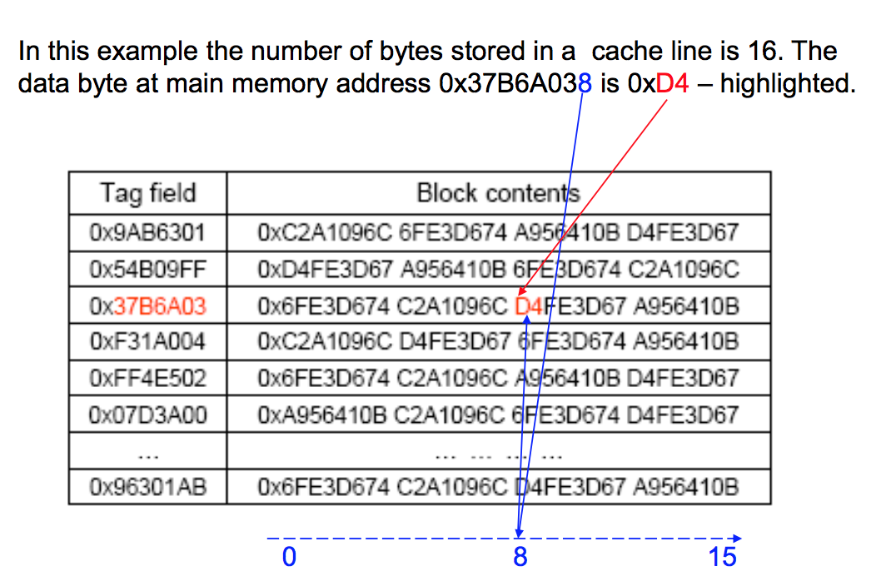
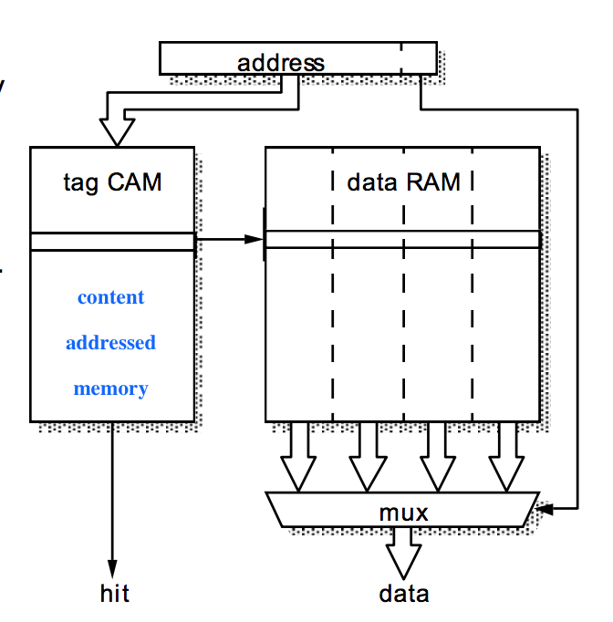
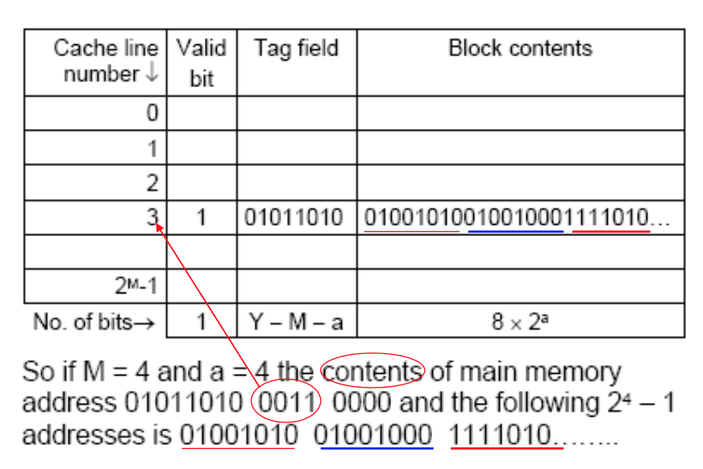
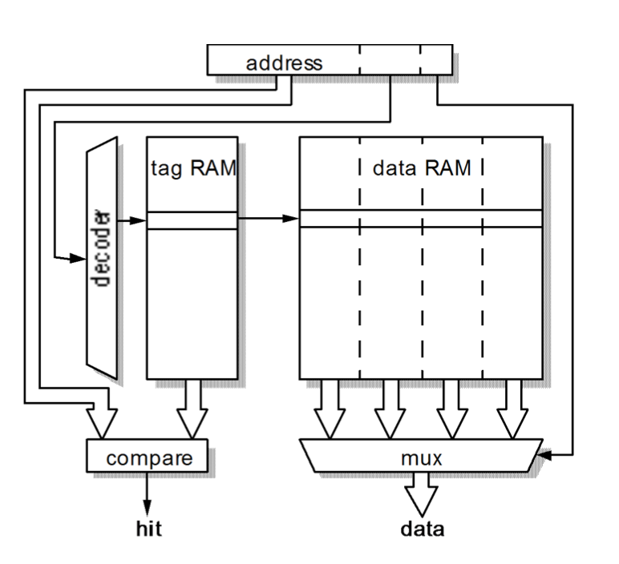
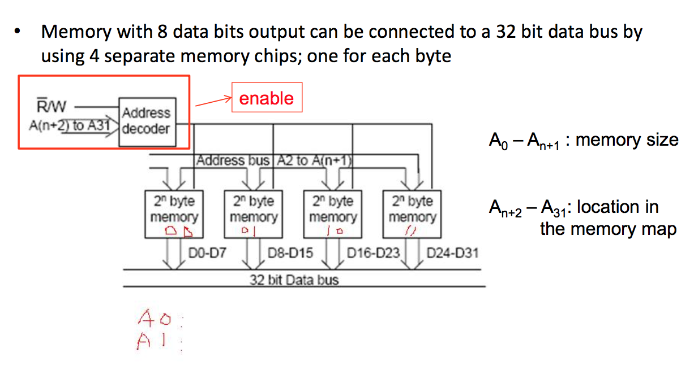

# Lecture 6

## Memory

a device that can store information in a binary format.

### Read-only memory (ROM)

used for the operating system on a desktop computer or an application program in an embedded system such as a mobile phone.

### Read-write memory (RAM)

used for an application program on a desktop computer and for temporary data.

### Types of ROM

- Programmable ROM (PROM) could be electrically programmed once only and then the contents were fixed.
- Erasable PROM (EPROM) could also have its contents erased by exposure to ultraviolet (UV) light and could then be reprogrammed.
- Electrically erasable PROM (EEPROM) could have its contents erased by an electrical signal.
- Flash Erasable PROM (FEPROM or flash memory) is similar to EEPROM but erasing could only be done over a significant part of (maybe all) the integrated circuit.

**All ROM is non-volatile** - meaning the information stored in ROM memory is not lost when it is disconnected from a power source.

In contrast the contents of RAM memory will be lost almost as soon as power is switched off - **RAM is volatile**.

### RAM

Random Access Memory

the time taken to read or store data from or to the memory (the ‘access time’) does not depend upon the order in which the data is accessed.

The memory locations can be accessed randomly or sequentially in the same time.

> This is not true for hard disks for example.

There are two types of RAM
- static
- dynamic

## Dynamic RAM

The contents of dynamic RAM (DRAM) **must be refreshed every few milliseconds**.

The binary data is held as an electrical charge on a
tiny capacitor
- a charged capacitor represents a binary 1
- whereas an discharged capacitor represents a binary 0.

However the charge on the capacitor can leak away so it must be topped up or refreshed every few milliseconds.

## Static RAM

Static RAM (SRAM) uses D type latches to store data
and **it does not need to be refreshed**.

The data stored in a SRAM memory will be retained
as long as it is connected to a power supply.

SRAM is **generally faster than DRAM** but needs a greater surface area of silicon (means **more expensive**) to store the same amount of data.

## Memory: fast or big?

In general a bigger memory is a slower memory.

The main memory of a microprocessor is typically DRAM.

## Memory Cache

a small fast on chip memory that holds the most recently accessed data from the main memory.

cache hit / miss

- **Temporal locality** occurs because data accessed once
is likely to be accessed again soon
- **Spatial locality** occurs because data from one memory location is likely to be accessed if data in an adjacent memory location has recently been accessed.

### hit rate

should be over 90% to achieve the best results with modern microprocessors.

Sometimes there may be two levels of cache
- ‘primary cache’ that is on chip
- off chip ‘secondary cache’.

Also there may be separate caches for instructions and data, like the ‘modified Harvard’ architecture.

HIT ratios over 0.95 (95% hits) can be obtained by good cache design.

$h$ will depend upon the program running.

Miss ratio, $m$

## Mean access time



## Multiple levels of cache

Very complex multiple cache systems are used with high performance CPUs, these have multiple caches operating at different levels.

## Cache control systems

Two main designs:
- associative cache
- direct mapped cache.

block = several bytes of main memory copied to one cache line.

### Associative cache



```
• Number of bytes in a block is X with X=2a where a is a fixed integer value, typically 4.
• The block number is the memory address right shifted a places so that if the main memory address has Y-bits, block number has Y- a bits.
• The cache memory has a very large word length - line length – longer than memory word length.
• Each cache line has a valid bit (tag) to show if the line holds a valid copy of main memory words (all set invalid at power up).
```

### Fully associative cache





### Direct-mapped cache



```
• Avoids cache search by relating cache line number to the main memory address.
• There are 2M lines in the cache with M bits used to identify each cache line.
• Main memory address is divided into three parts, the least a significant a bits are discarded as each cache line contains 2 bytes.
• The next M bits are used as the cache line number - so several different main memory addresses correspond to a single line in the cache.
• The most significant (Y − M − a) bits are used to determine which address is in cache and these are stored in the cache line as a tag field.
```



### Write access problem

Two basic solutions –
- write through
  - every cache write, simultaneously writes to main memory.
- copy back.
  - cache line has an extra bit that is cleared on loading, if a write is performed, it is set.

A minor additional decision is the action on a **write miss**, simple system is to put into cache, an alternative is to only alter main memory.

> Simple 4 byte ROM addressing

Connecting to a 32 bit data bus



## Input and output

Input to and output from a microprocessor can be arranged in two ways:
– either as an additional subsystem with dedicated hardware – or as part of the memory system.

Many microprocessors, include the ARM, use ‘memory mapped’ input and output.

Not all of this ‘addressable space’ will be filled with actual memory so that there are many ‘empty’ memory locations.

Memory mapped input ports and output ports are assigned a memory address and
- A register load from that address is equivalent to an input.
- A register store to that address is equivalent to an output.

### Peripheral Communication

There are two basic communication techniques:
- Polling
  - programming the processor to repeatedly check to see if the communication task has been completed or not
- Interrupts
  - either the processor issues commands to the peripheral to start communication task, then wait for an interrupt to signal completion of the task, or the processor waits for an interrupt from the peripheral to start communication task.

#### The Device Driver Philosophy

```
The benefits of good device driver design are threefold:
• First, because of the modularization, the structure of the overall software is
easier to understand;
• Second, because there is only one module that ever interacts directly with
the peripheral’s registers, the state of the hardware can be more accurately
tracked
• Last but not least, software changes that result from hardware changes are
localized to the device driver.
```

```
Device Driver Implementation
1. A data structure that overlays the memory-mapped control and status registers of the device. To make the bits within the control register easier to read and write individually, we might also define bitmasks such as:
#define TIMER_ENABLE    0xC000  // Enable the timer
#define TIMER_DISABLE   0x4000  // Disable the timer
#define TIMER_INTERRUPT 0x2000  // Enable timer interrupt
2. A set of variables to track the current state of the hardware and device driver;
3. A routine to initialize the hardware to a known state;
4. A set of routine that, taken together, provide an API for users of the device
drive, such as sending and receiving messages, checking whether it is
running correctly (health check), etc.;
5. One or more interrupt service routines.
```


...
