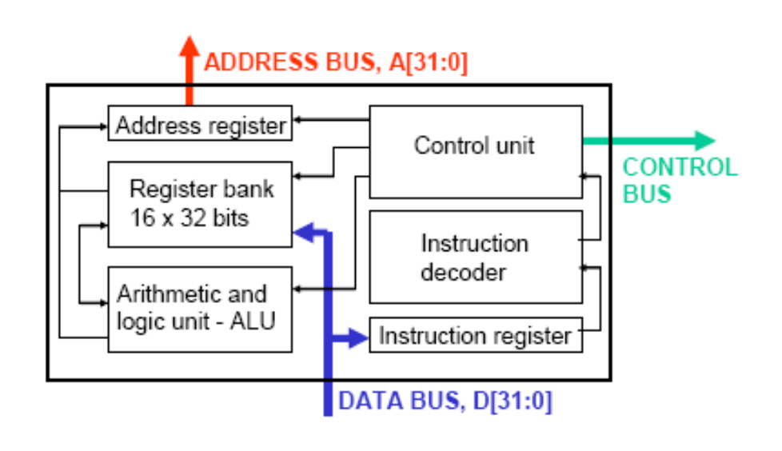
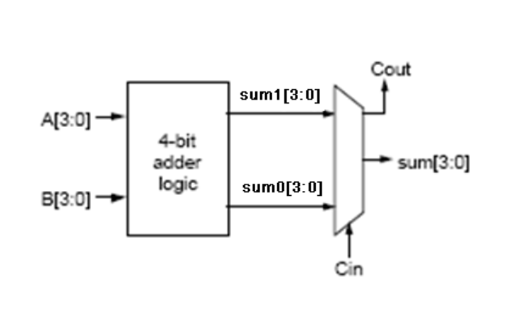
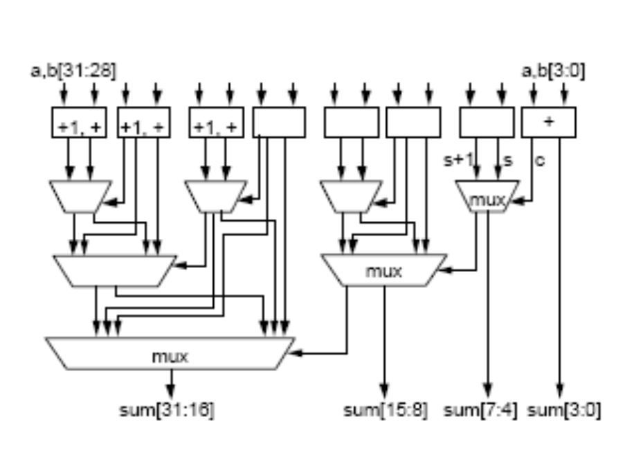
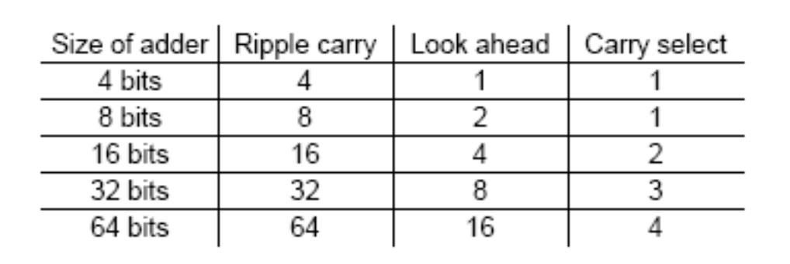
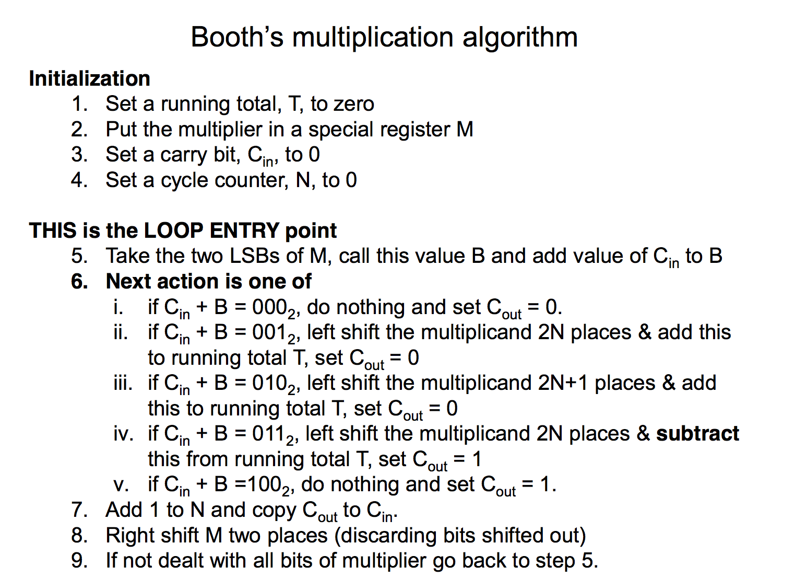
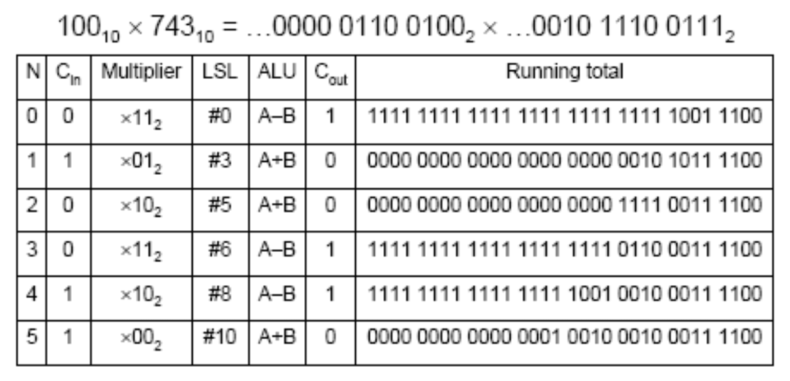
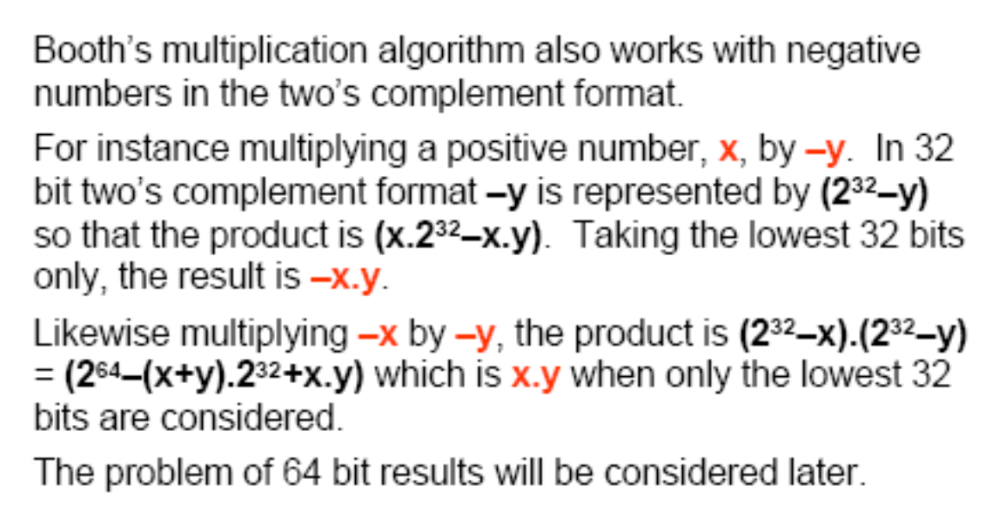
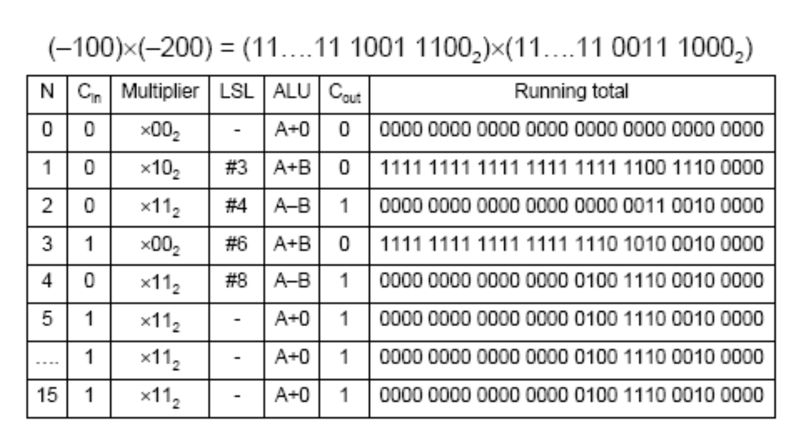
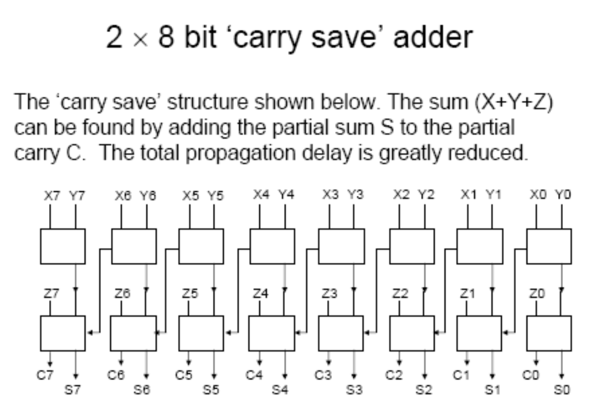

# Lecture 7

## How do you make a computer?

- Input and output devices
- Memory (for both data and instructions)
- A CPU that can be further broken down into
    1) control circuits
    2) instruction decoder
    3) arithmetic and logic circuits (ALU).

Furber differentiates between computer architecture and computer organization

> Computer architecture describes the user's view of the computer. The instruction set, visible registers, memory management table structures and exception handling model are all part of the architecture.

> Computer organization describes the user- invisible implementation of the architecture. The pipeline structure, transparent cache, table-walking hardware and translation look-aside buffer are all aspects of the organization.

The core component is the CPU which contains
- control circuits
- registers
- instruction decoding circuits
- an arithmetic and logic unit (ALU)
- an oscillator or clock to drive the system

## Von Neumann systems

The basic von Neumann architecture/structure has
- Memory for storing both data and instructions
- Control and decode
- Arithmetic unit (now arithmetic and logic unit, ALU)
- Input and output, IO, mechanisms

### The von Neumann cycle

### MU0 – A simple microprocessor

(See slides)

## ARM7 CPU architecture

## ALU circuits: design problem

### Combinational logic circuit design

Design of large combinational (e.g. arithmetic) circuits
– some approaches

- modular methods (e.g. cell technique)
- replace by connected more simple modules used in sequence –
convert to a sequential circuit.

### Modular - the cell technique

- break the circuit into separate modules – cells
- the chosen cells are small enough to be designed and built
- if possible only a small number of different types of cell are used.
- the cells are interconnected to form the complete circuit.

#### ALU adder design

A half-adder for the LSB and a full-adder for the other bits.

Connect the cells to give a ripple-carry adder.

Problem with ripple-carry adder

- Each cell causes a propagation delay
- For an adder with many bits, the delays become very long.

#### ARM1 ripple-carry adder circuit

#### ARM2 4-bit carry look-ahead

8 propagation delays for a 32 bit adder.

#### ARM6 carry-select adder

For a 32 bit adder there are **a maximum of 3 propagation delays** in the carry path.

#### Performance comparison

The performance improvement is at the expense of more complicated circuits using more electrical power.

### Other arithmetic functions

- Subtraction
  - using twos complement, an adder will perform subtraction. Or use ones complement and set ‘carry-in’ to logic 1.
- Multiplication
  - complicated, consider 0110 × 1001

### Multiplication circuits

A matrix multiplier for 32-bit numbers needs 32×32 AND gates and 31 (32 bit) adders.

This would require **a large number of logic gates** and it would suffer from the problem of **multiple propagation delays on the carry path**.

Most multiplier circuits use sequential logic.

#### Sequential approach

In simple form it requires double length registers and a shifter.
1. Set a total to zero.
2. Examine the LSB of the multiplier, if it is 1 add the multiplicand to the
total otherwise do nothing.
3. Shift the multiplicand one place left moving in 0 as LSB.
4. Shift the multiplier one place right discarding the old LSB and moving
in zero.
5. Repeat from 2 until all bits of multiplier tested (alternatively can end
when multiplier is zero).

Problem: To perform a 32 bit multiplication would need 32 steps i.e. 32 clock cycles – too long.

#### An improved rule (algorithm) - **Booth’s algorithm**

This is another possible sequence using an existing adder and a shifter.

The multiplication can end when only zeros are left in the multiplier.

Example:

#### Booth’s algorithm for negative numbers

Example:

Using just the existing adder and barrel shifter a 32 bit multiplication can be completed in 16 cycles using Booth’s algorithm.

#### Further performance improvements

The ARM uses a special adder circuit that adds five 32 bit numbers together in one combinational logic circuit.

Carry save adder

The ARM high performance multiplier uses a 4 × 32 bit carry save adder to add six numbers, a running total (partial sum and partial carry) and four values produced using Booth’s algorithm.

**!!! Very challenging**

The maximum propagation delay is a carry path of 4 gates; short enough to be completed in one clock cycle.

### Signed and unsigned products

The ARM microprocessor supports both forms of long multiplication with two different instructions; `UMULL` for unsigned integers and `SMULL` using 2’s complement.

The ARM multiplier uses Booth’s algorithm with a dedicated carry save adder to complete a 32 bit multiplication in 5 cycles. It can complete execution in less than 5 cycles if multiplier has leading zeros.

...
