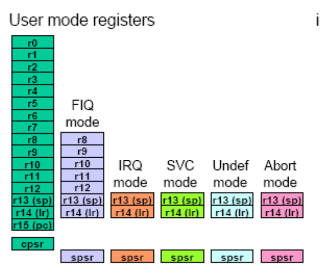
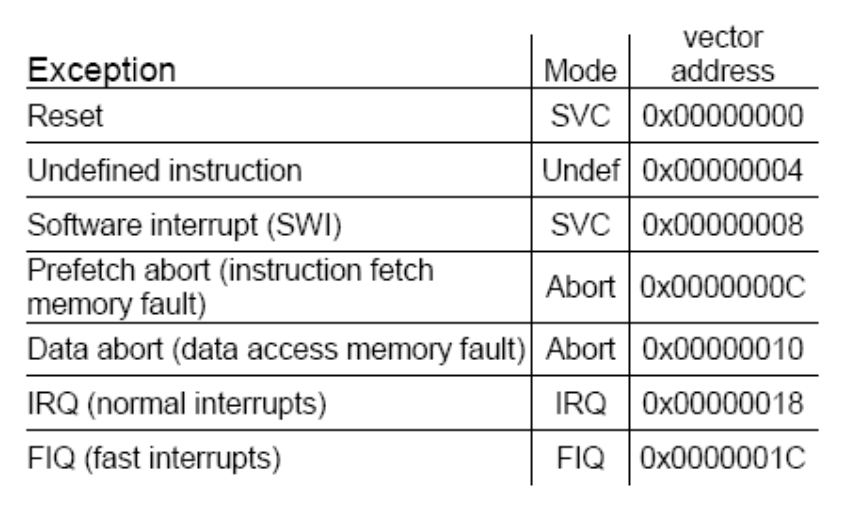

# Lecture 8

Processor Modes & Thumb Code

## Processor Modes

The ARM processor has 7 ‘processor modes’

- Usermode
- FIQ mode
- IRQ mode
- Supervisor
- Abort
- Undef
- System

Supervisor mode is entered on reset or when a software interrupt (SWI) instruction is executed.

Abort mode is used when a memory access violation occurs, either on an instruction fetch or on a data read/write.

Undef mode is entered when the instruction decoder encounters machine code for which there is no instruction.

System mode is a privileged mode used for the operating system.

### Different registers in each mode

## Current program status register `cpsr`

When the processor changes mode the ‘old’ contents of the cpsr are copied into the saved program status register (spsr) for the new mode.

There are five spsr registers, one for each mode except User mode and System mode.

## Exception vectors

When an interrupt occurs the program counter (r15) is reloaded with the exception vector value.

We have already covered the exception vectors for IRQ (`0x00000018`) and FIQ (`0x0000001C`).

When the power is first connected to the processor, a reset occurs and the program counter is loaded with the exception vector value `0x00000000` (usually an unconditional branch instruction).

### Vector Table

### Action upon an exception

1. The `cpsr` is copied into the relevant `spsr`.
2. The processor switches mode – the mode bits in the `cpsr` are changed as appropriate.
3. If appropriate, interrupts are disabled by setting the relevant bit or bits in the `cpsr`, e.g. an FIQ disables IRQ.
4. The return address is stored in the relevant link register.
5. The program counter is reloaded with the relevant vector address.

### Thumb instruction set

Thumb instructions are 16 bit compressed ARM instructions.

`AND r6, r5` `0x402E`

the value in register r5 with the value in register r6 and leave the result in register r6.

`ADD r1, #0x36` `0x3136`

add 54 to value in register r1 and put the sum in register r1.

#### Restrictions

In order to fit Thumb instructions into 16 bits, many of the features of ARM instructions are lost.

- Most Thumb instructions are not conditionally executable
- only branches can be conditional.
- Only `r0` to `r7` are used with most Thumb instructions.
- Most Thumb instructions use one of the source registers as the destination register.
- Immediate values can not be rotated.
- There is no option on the setting of flags – most Thumb
instructions set the flags.

### Thumb de-compressor

The ARM instruction decoder includes a combinational logic circuit known as the Thumb de-compressor.

When the processor is executing Thumb code (T bit set in the `cpsr`) then each 32 bit word is split into two half words.

One of the 16 bit codes is ‘mapped’ into the equivalent 32 bit ARM code (e.g. `0x402E` converts to `0xE0166005`) and the processor decodes and executes that instruction.

On the next clock cycle the de-compressor converts the other half word into the equivalent ARM code which can then be decoded and executed.

### Thumb – why?

Thumb code uses approx. 40% more instructions for a given task than ARM code.

As a result Thumb code occupies about 70% of the memory space used by ARM – it has a better ‘code density’ – and it uses 30% less external memory power as a result.

### Thumb v. ARM

ARM code is 40% faster than Thumb code if instructions are fetched on a 32 bit bus, so in a system where performance is paramount, ARM code and a 32 bit memory system are used.

However in a 16 bit memory system, Thumb code is 45% faster than ARM code. In a system where memory cost and power consumption are important then a 16 bit memory system and Thumb code would be the better choice.

Most systems use a bit of each; **ARM code for the critical routines and Thumb code for background tasks**.

...
